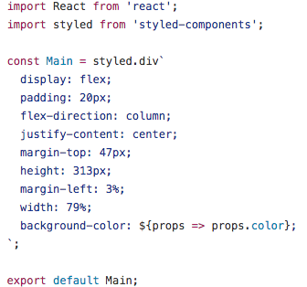

## Color Helper

I made this app because I find using dev tools or color palates to pick colors to be slow. This is a much quicker way to find the right fit of colors
for your personal project or app. This app using 'styled-components' which using inline styles to kick off clean, reusable and dynamic components.

 
example of 'styled-components'

## Next 

Moving forward I have created some product mockups to be implmented into different color customizations views.

## Get started

To build: npm run build

To start the server: npm run start

To start in dev mode, with everything watched: npm run watch
